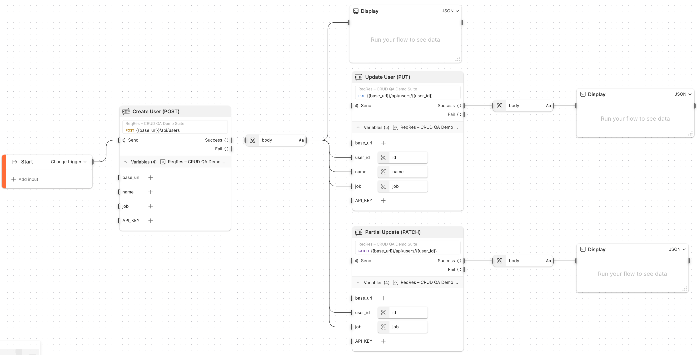
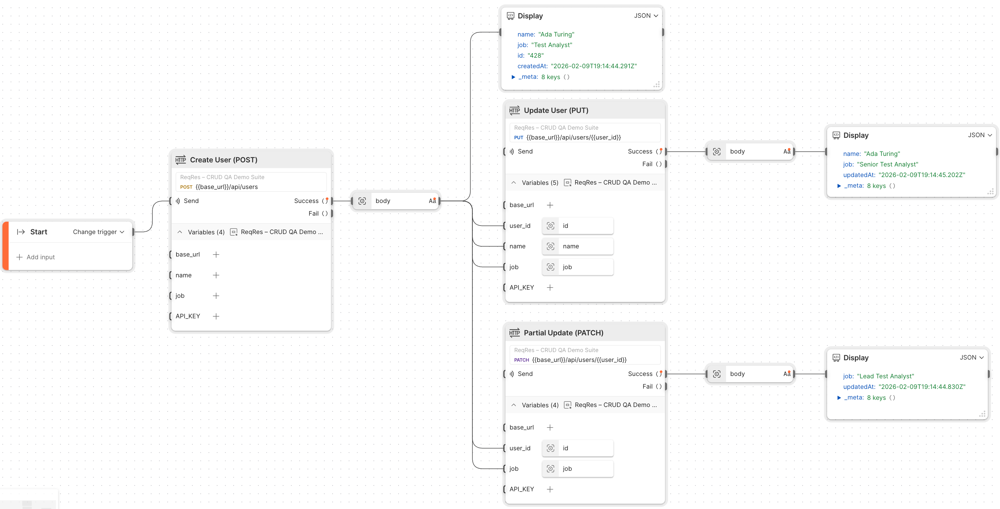

# ReqRes – CRUD QA Demo Suite (Postman)

**Create, Read, Update,** and **Delete** API tests against [`https://reqres.in`](https://reqres.in) **using Postman, environment variables, assertions, and a visual Flow** that chains calls together.

This project is meant as a **small but realistic QA API demo**:

- randomised test data
- response validations (status, headers, and body)
- variable chaining between requests - via environment variables (`{{user_id}}`) and via Flow wiring (`body.id` → `user_id`).
- a Flow design that fans out `POST` → (`PUT` and `PATCH` in parallel)

---

## Structure

- `ReqRes-CRUD-QA-Demo-Suite.postman_collection.json` - Postman collection containing all CRUD requests and tests.
- `ReqRes-CRUD-QA-Demo-Env.postman_environment.json` – Environment configuration containing the variables needed to run the CRUD tests.
- `flows/img/reqres-flow-before.png` - Flow screenshot (before execution).
- `flows/img/reqres-flow-after.png` - Flow screenshot (after execution).

---

## Requirements

- Postman Desktop app (v11+ recommended)
- A **free ReqRes API key** (sign up at [reqres.in](https://reqres.in))

#### IMPORTANT NOTE ON RATE LIMITS

> **ReqRes applies request limits on free API keys.**
> This suite is intentionally small and designed to run within free-tier limits for most users. But if you hit **HTTP 429 (Too Many Requests)**, wait and re-run later (or reduce repeated runs).
>
> The `qa-portfolio` repo also includes an alternative postman project ([REST Countries](../rest-countries/)) that run without any key and limits.

---

## Setup

### 1. **Import the collection and the environment**

- In Postman: `Import` → select
  - `ReqRes-CRUD-QA-Demo-Suite.postman_collection.json`.
  - `ReqRes-CRUD-QA-Demo-Env.postman_environment.json`.

### 2. **Activate the environment**

Select **ReqRes – CRUD QA Demo Env** from the environment dropdown (top-right).

### 3. **Configure environment variables**

Open the environment (Environments → select `ReqRes – CRUD QA Demo Env`), and set:

- `base_url` → `https://reqres.in`
- `user_id` → `5` (an existing id)
- `name`, `job` → leave empty; they will be filled during `Create User (POST)` run
- `API_KEY` → your own ReqRes API key

#### **Security Note:**

> The committed environment file keeps `API_KEY` blank on purpose.
> Do **not** commit your personal key back to Git.

---

## What the collection tests do

### 1. Create User (POST)

- **Endpoint:** `POST {{base_url}}/api/users`
- **Body:** `{"name":"{{name}}", "job":"{{job}}"}`
- **Pre-request script:**
  - generates a random full name (`name`)
  - picks a random `job` from a small roles list
  - saves them to environment as `name` and `job` respectively
- **Assertions:**
  - status `201 Created`
  - response time `< 1200 ms`
  - `Content-Type` header includes `application/json`
  - body has `id` and `createdAt`
- **Chaining:**
  - saves `id` to environment as `created_id`, while `user_id` remains a fixed known user, that is used for the subsequent `PUT` / `PATCH` / `GET` / `DELETE` requests.

### 2. Update User (PUT)

- **Endpoint:** `PUT {{base_url}}/api/users/{{user_id}}`
- **Body:** `{"name":"{{name}}", "job":"Senior {{job}}"}`
- **Assertions:**
  - status `200 OK`
  - response time `< 1200 ms`
  - `Content-Type` includes `application/json`
  - body has `updatedAt`

### 3. Partial Update (PATCH)

- **Endpoint:** `PATCH {{base_url}}/api/users/{{user_id}}`
- **Body:** `{ "job": "Lead {{job}}" }`
- **Assertions:**
  - status `200 OK`
  - response time `< 1200 ms`
  - `Content-Type` includes `application/json`
  - body has `updatedAt`

### 4. Get User (GET)

- **Endpoint:** `GET {{base_url}}/api/users/{{user_id}}`
- **Assertions:**
  - status `200 OK`
  - response time `< 1200 ms`
  - `Content-Type` includes `application/json`
  - body has `data.id`

### 5. Delete User (DELETE)

- **Endpoint:** `DELETE {{base_url}}/api/users/{{user_id}}`
- **Assertions:**
  - status `204 No Content`

> **NOTE:** The ReqRes API returns `204` even if the user does not exist.
> For demo purposes this still validates the `DELETE` operation pattern.

---

## Flow: end-to-end CRUD orchestration

This project also includes a **Postman Flow** that wires all requests together:

1. `Create User (POST)`
   - Runs with randomised name/job
   - Output body is exposed as a Flow variable (`body`)

2. The Flow extracts:
   - `body.id` → `user_id`
   - `body.name` and `body.job` (carried over for PUT/PATCH)
   - Output is displayed in a JSON `Display` block

3. `Update User (PUT)`
   - Uses `user_id` extracted from the `POST` response
   - Updates `job` to “Senior …”
   - Output is displayed in a JSON `Display` block

4. `Partial Update (PATCH)`
   - Uses the same `user_id` (extracted from the `POST` response)
   - Changes `job` to “Lead …”
   - Output is displayed in a JSON `Display` block

### Screenshots:

- **Before** running the Flow:

- **After** a sample run (showing chained responses):

#### NOTE:

> The screenshots in `flows/img` show a Postman Flow wiring the `create`/`update`/`patch` steps together visually.
> The Flow itself is not exported in this repo; it can be recreated in Postman using the same collection and environment if desired.

---

## How to run the suite

### A. Run individual requests

1. Go to `Collections` and select the `ReqRes – CRUD QA Demo Suite` collection.
2. Ensure the `ReqRes – CRUD QA Demo Env` environment is active (from the dropdown in the top-right).
3. Pick a request (e.g. `Create User (POST)`).
   - run **`Create User (POST)`** the **very first time** to fill the environment variables

4. Click **Send** and inspect:
   - status code
   - response time
   - body and test results tabs (Postman test assertions)

### B. Run as a collection

1. Select the `ReqRes – CRUD QA Demo Suite` collection.
2. Click the **Run** button.
3. Ensure the `ReqRes – CRUD QA Demo Env` environment is active (from the dropdown in the top-right).
4. Run all requests in order to see a full CRUD pass.

---

## Notes for reviewers

- **Rate limits:** ReqRes may return **429 Too Many Requests** on free keys depending on usage. The workflow in this repo is designed to keep runs lightweight; if you hit 429, re-run later.
- The **API key** is **parameterised** via `{{API_KEY}}` and **not committed** to the repo.
- `base_url` is environment-driven, although **this collection is designed specifically for the ReqRes API.**
- Tests include both **functional checks** (status codes, JSON schema expectations) and light **non-functional checks** (basic response time thresholds).
